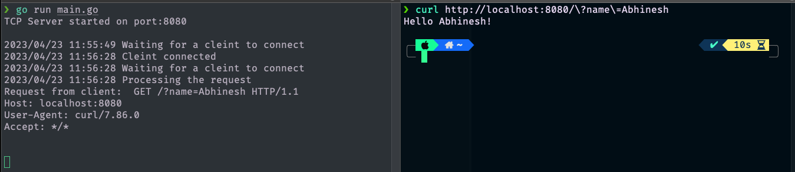
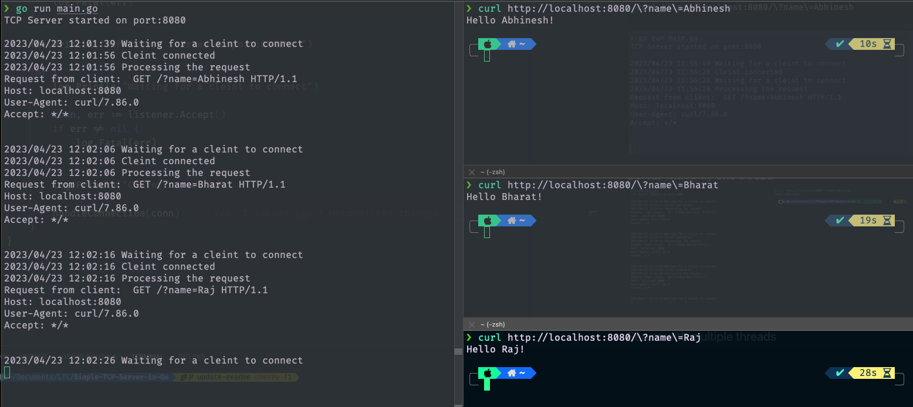

# Simple-TCP-Server-in-Go=

## Start TCP Server
```sh
go run main.go
```

## Start new terminal and send http request to server
```sh
curl http://localhost:8080/\?name\=Abhinesh 
```




## Server with only one thread



## Server with multiple threads


## Improvements

- [ ] Support for Worker Pool since server will not have enough resources.
- [ ] Support for time out if request is taking more time than defined threshold

